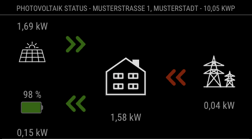
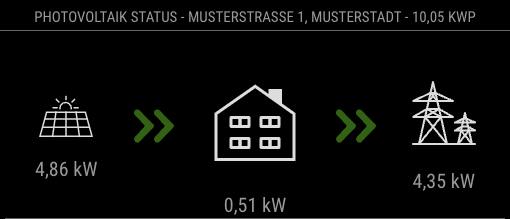
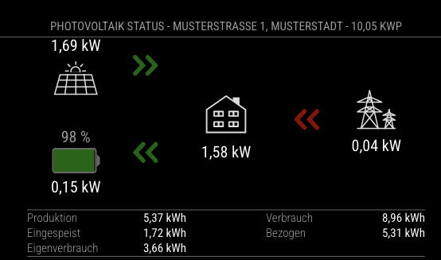
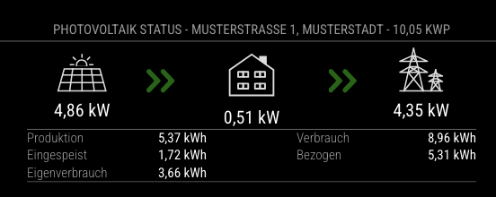

# MMM-SunGrow

A MagicMirror² module that integrates with the **SunGrow** monitoring/management API to display real-time data for your SunGrow-based PV and battery storage system.

It is a rework of the Module [MMM-SolarEdge](https://github.com/st3v0rr/MMM-SolarEdge) to work with the SunGrow API. 

> **Note**: This module is under active development. Features and API endpoints may change.

---

## Features

- **Current Power**: Displays real-time power flow for:
    - **PV** (solar generation),
    - **Battery** (charging/discharging level and SoC),
    - **Load** (consumption),
    - **Grid** (feed-in vs. purchased).
- **Daily Data** (Optional):
    - Day energy totals (Production, Consumption, FeedIn, Purchased, SelfConsumption).
- **System Details** (Optional):
    - Location address, installed capacity, and more.

---

## Installation

1. Navigate to your MagicMirror `modules` folder:

   ```bash
   cd ~/MagicMirror/modules
2. Clone this repository:

   ```bash
   git clone https://github.com/GhostTalker/MMM-SunGrow.git
   cd MMM-SunGrow
   
3. Install dependencies:

   ```bash
   npm install

4. Wait until npm finishes installing.

## Using the Module

1. **Add the module** to your `config.js`:

   ```js
   {
     module: "MMM-SunGrow",
     position: "lower_third",                       // or your preferred region
     config: {
       appKey: "YOUR_APP_KEY",                      // From SunGrow iSolarCloud Developer Portal
       secretKey: "YOUR_SECRET_KEY",                // From SunGrow iSolarCloud Developer Portal
       plantId: "xxxxxxx",                          // SunGrow plant id 
       plantSN: "xxxxxxxxxx",                       // SunGrow plant serialnumber 
       userName: "yourSunGrowUser",                 // iSolarCloud username
       userPassword: "yourSunGrowPass",             // iSolarCloud password
       portalUrl: "https://gateway.isolarcloud.eu", // or your region’s endpoint
       updateInterval: 10 * 1000,                   // frequency for refreshing real-time data (ms)
       updateIntervalBasicData: 15 * 60 * 1000,     // e.g., for day data
       showDayEnergy: true,                         // display daily stats
       showOverview: false,                         // disable overview by default (placeholder)
       compactMode: true,
       decimal: "comma",                            // "comma" or "period"
       mockData: false                              // for testing without the real API
     }
   }
> Position can be changed to suit your layout.
> 
> **Note**: If you only want daily data or only current power, you can disable the other calls in MMM-SunGrow.js or by changing the config flags (e.g., showOverview: false).

## Configuration Options

| **Option**                 | **Description**                                                                                              |
|---------------------------|--------------------------------------------------------------------------------------------------------------|
| `appKey`                  | **Required**. App Key from your iSolarCloud developer portal.                                                |
| `secretKey`               | **Required**. Secret Key from your iSolarCloud developer portal.                                             |
| `plantId`                 | **Required**. The numeric site ID (used in `ps_key_list`).                                                   |
| `plantSN`                 | **Required**. The station’s serial number for detail calls (`getPowerStationDetail`).                        |
| `userName`                | **Required**. iSolarCloud account username.                                                                  |
| `userPassword`            | **Required**. iSolarCloud account password.                                                                  |
| `portalUrl`               | **Optional**. Default is `https://gateway.isolarcloud.eu`; change if you have a different region’s endpoint. |
| `updateInterval`          | **Optional**. Interval (in ms) for refreshing real-time data. Default is `10 * 1000` (10 seconds).           |
| `updateIntervalBasicData` | **Optional**. Interval for less-frequent data (e.g., day stats). Default is `15 * 60 * 1000` (15 minutes).   |
| `showDayEnergy`           | **Optional**. If `true`, fetch daily stats (production, consumption, etc.). Default is `true`.               |
| `showOverview`            | **Optional**. If `true`, fetch a separate overview dataset. Default is `false` (placeholder in code).        |
| `compactMode`             | **Optional**. A UI style toggle. Default is `false`.                                                         |
| `decimal`                 | **Optional**. `"comma"` or `"period"`. Controls how numbers are displayed. Default is `"comma"`.             |


---

## API Calls & Data Flow

- **`fetchCurrentPowerData()`** – Retrieves real-time flow for PV, Battery, Load, and Grid from `/openapi/getDeviceRealTimeData`.
- **`fetchDetailsData()`** – Gets site details (address, design capacity, etc.) from `/openapi/getPowerStationDetail`.
- **`fetchDayEnergyData()`** – (Optional) Retrieves daily stats (Production, Consumption, FeedIn, Purchased, SelfConsumption).

---

## Example log output
````
[2025-01-11 17:54:32.340] [LOG]   Module helper loaded: MMM-SunGrow
[2025-01-11 17:54:37.688] [LOG]   Connecting socket for: MMM-SunGrow
[2025-01-11 17:54:52.930] [LOG]   [MMM-SunGrow] Received config successfully
[2025-01-11 17:54:52.964] [LOG]   [MMM-SunGrow] Waiting for ongoing login to finish...
[2025-01-11 17:54:53.457] [LOG]   [MMM-SunGrow] /openapi/login success
[2025-01-11 17:54:53.463] [LOG]   [MMM-SunGrow] fetchCurrentPowerData() - calling fetchCurrentPowerData for live stats
[2025-01-11 17:55:01.888] [LOG]   [MMM-SunGrow] fetchDayEnergyData() - calling getDeviceRealTimeData for daily stats
``````

## Example output on MagicMirror²









---

## Troubleshooting

1. **401 / Unauthorized**
    - Verify only **one** active token. The module tries to manage logins so tokens don’t clash.
    - Double-check `appKey`/`secretKey` and `portalUrl`.

2. **No data**
    - Confirm your station is actually online.
    - Check logs (`npm start dev` or `pm2 logs`) for errors.

3. **Decimal symbol**
    - Switch `decimal` to `"comma"` or `"period"` if you see the wrong format.

---

## License

MIT License - see [LICENSE](https://github.com/GhostTalker/MMM-SunGrow/blob/main/LICENSE.txt) for details.

Enjoy your **SunGrow** stats on MagicMirror!